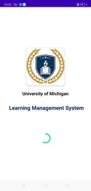
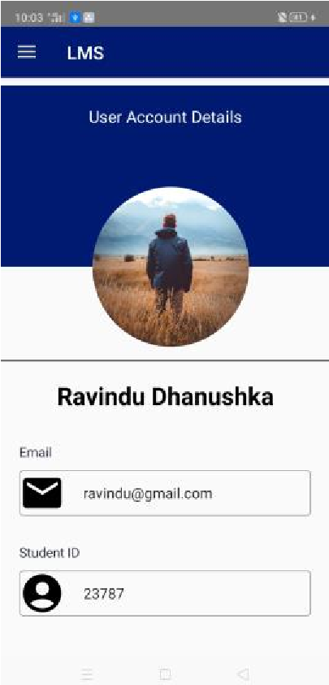
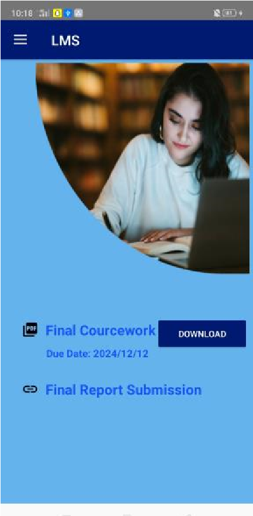
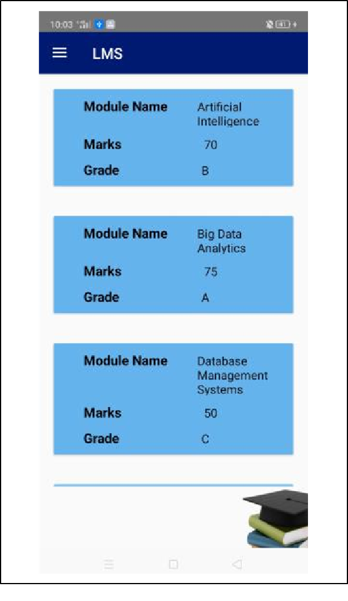

# Learning-management-system


## About The Project
 Through 
our mobile app, students and lecturers at the university can do their work more easily. Using our mobile application, and students can easily access their course-related modules, study materials, schedule, and exam marks. Students can log into the system using their username and password. The student's information can be viewed in the user detail account. We created a slide navigation bar in our mobile app to navigate each activity. We have allowed students to submit assignments and exam papers related to each module through the coursework activity. The students' respective module codes, names, marks, and grades are displayed in the mark's module.

Apart from the students, we have also facilitated the lectures so that they can easily interact with their students. Students, as well as lecturers, can log into the system using their username and password. They also have a user account that includes their information. Lecturers can upload lecture materials related to their degree programs for their students to view.

### Built With
* [Android Studio](https://developer.android.com/studio)
* [Java](https://www.java.com/en/)
* [Firebase](https://firebase.google.com/)
* [Adobe XD](https://www.adobe.com/products/xd.html)

## Getting Started
### Prerequisites
* Android Studio
* Java
* Firebase
* Adobe XD


### Installation
1. Clone the repo
   ```sh
   git clone https://github.com/ravindu0823/Learning-management-system
    ```
2. Open the project in Android Studio
3. Run the project


## Usage
### Loading Screen



### Login


### Modules


### User Account


### Coursework


### Marks
